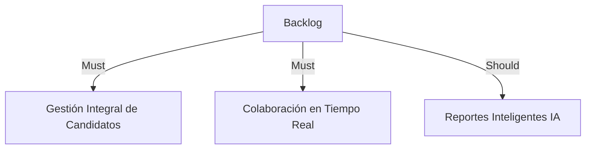
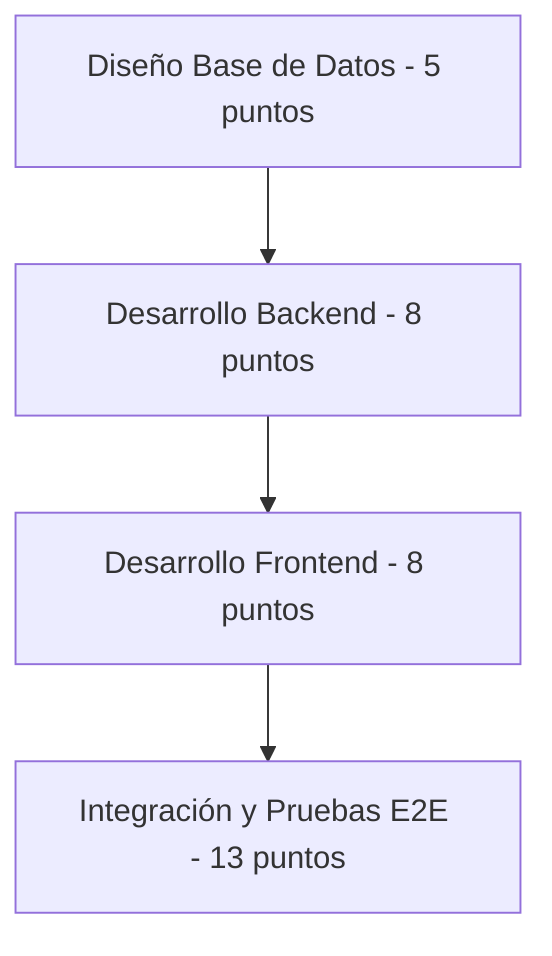
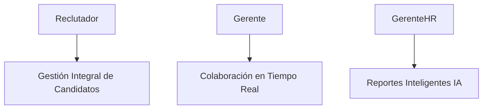
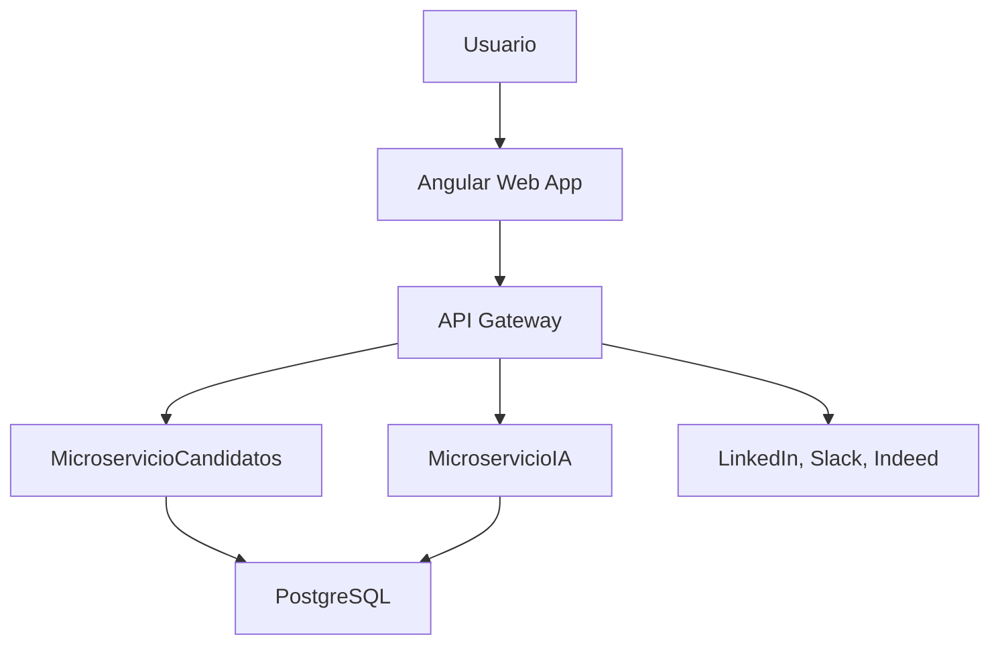

# Documentación para Implementación de LTI

### User Story 1: Gestión Integral de Candidatos

**Formato:** Como reclutador, quiero gestionar integralmente el proceso desde la recepción del CV hasta la contratación, para optimizar tiempos y calidad.

**Descripción:**  
Como reclutador, necesito tener control absoluto sobre el proceso de selección, facilitando la revisión y gestión rápida de la información relevante sobre cada candidato.

**Criterios de Aceptación:**  
- Dado que recibo un nuevo CV, cuando lo agrego al sistema, entonces recibo una notificación automática.
- Dado que visualizo la lista de candidatos, cuando selecciono uno específico, entonces veo claramente el estado y detalles relevantes.
- Dado que accedo a un candidato específico, cuando necesito revisar documentos, entonces puedo acceder a estos fácilmente.

**Notas adicionales:**  
Esta historia impacta directamente en la eficiencia operativa del equipo de reclutamiento.

**Tareas:**  
- Diseño del modelo de datos.
- Desarrollo backend API REST.
- Desarrollo interfaz frontend.
- Integración y pruebas.

**Prioridad:** Alta

### User Story 2: Colaboración en Tiempo Real

**Formato:** Como gerente, quiero colaborar en tiempo real con reclutadores para evaluar candidatos rápidamente y tomar mejores decisiones.

**Descripción:**  
Como gerente necesito poder interactuar rápidamente con el equipo de reclutamiento para compartir opiniones, agilizar el proceso y reducir el tiempo de toma de decisiones.

**Criterios de Aceptación:**  
- Dado que estoy revisando un candidato, cuando realizo un comentario, entonces los reclutadores reciben una notificación inmediata.
- Dado que recibo un comentario de un reclutador, cuando respondo, entonces queda un historial visible para ambos.
- Dado que accedo al historial, cuando necesito revisar decisiones anteriores, entonces puedo hacerlo fácilmente.

**Notas adicionales:**  
Clave para aumentar la colaboración y mejorar decisiones rápidas.

**Tareas:**  
- Desarrollar sistema de comentarios en tiempo real.
- Implementar notificaciones inmediatas.
- Crear registro histórico de comentarios.

**Prioridad:** Alta

### User Story 3: Reportes Inteligentes con IA

**Formato:** Como gerente de HR, necesito reportes predictivos generados por IA para tomar decisiones de contratación más informadas.

**Descripción:**  
Los reportes predictivos generados automáticamente facilitan identificar rápidamente los candidatos más adecuados y reducen errores en la toma de decisiones.

**Criterios de Aceptación:**  
- Dado que solicito un reporte, cuando lo genera el sistema, entonces muestra claramente métricas predictivas relevantes.
- Dado que visualizo un reporte, cuando deseo exportarlo, entonces puedo hacerlo en PDF o Excel.
- Dado que se actualizan datos de candidatos, cuando solicito un nuevo reporte, entonces la información está actualizada y refleja los últimos cambios.

**Notas adicionales:**  
Esto facilita decisiones estratégicas en procesos complejos.

**Tareas:**  
- Desarrollo módulo IA para generación de reportes.
- Integración del módulo IA con el sistema existente.
- Desarrollo de funcionalidades de exportación de reportes.

**Prioridad:** Media-Alta

## Backlog del Producto (MoSCoW)

## Tickets Técnicos para User Story: Gestión Integral de Candidatos

| Ticket | Descripción técnica                       | Criterios de aceptación                         | Esfuerzo |
|--------|-------------------------------------------|-------------------------------------------------|----------|
| 1      | Diseño del modelo de base de datos        | Script SQL creado, revisión DBA completada      | 5        |
| 2      | Desarrollo backend API REST               | Endpoints CRUD operativos, pruebas unitarias OK | 8        |
| 3      | Desarrollo frontend Angular               | Pantalla operativa, pruebas integración OK      | 8        |
| 4      | Integración y pruebas end-to-end          | Flujo completo sin errores críticos             | 13       |

## Diagrama Técnico (Tickets)

## Diagramas Casos de Uso

## Diagrama de Alto Nivel
