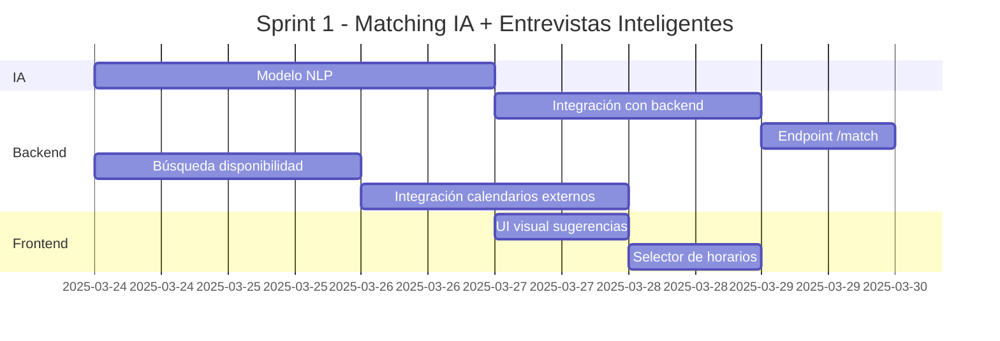

# 🧠 Documentación Técnica – MVP HawkeyeHire

---

## 1. Visión General del Proyecto

**HawkeyeHire** es una plataforma ATS (Applicant Tracking System) impulsada por Inteligencia Artificial, diseñada para optimizar todo el ciclo de reclutamiento: desde la atracción de talento hasta la selección, entrevistas y análisis de desempeño.

El MVP apunta a entregar dos módulos críticos: **Matching IA** y **Programación de Entrevistas Inteligentes**.

---

## 2. Épicas

| Epic ID | Título                                | Descripción                                                                 | Valor de negocio                          |
|--------|----------------------------------------|-----------------------------------------------------------------------------|-------------------------------------------|
| E-01   | Matching Semántico IA                  | Puntuación y sugerencia de candidatos basada en NLP                         | Acelera decisiones de contratación         |
| E-02   | Coordinación Automática de Entrevistas | Sistema inteligente para agendado óptimo entre candidatos y entrevistadores | Ahorra tiempo de gestión manual           |
| E-03   | Vista UX de Revisión de Candidatos     | Interfaz visual para análisis de resultados IA                              | Mejora UX y toma de decisión visual        |
| E-04   | Feedback para IA                       | Retroalimentación sobre sugerencias para mejorar predicción futura         | Aumenta precisión del sistema              |

---

## 3. Historias de Usuario

### US-01 – Matching automático de CVs y vacantes  
**Epic ID:** E-01  
> Como reclutador, quiero que el sistema me sugiera automáticamente candidatos compatibles con la vacante usando IA, para ahorrar tiempo en la revisión manual de CVs.

**Criterios de Aceptación**  
- Dado que se carga un nuevo CV, cuando se guarda en la base de datos, entonces el sistema debe generar un score de compatibilidad con la vacante activa.
- Dado que accedo a la vista de vacantes, cuando selecciono una vacante específica, entonces se debe mostrar un ranking ordenado por score IA.
- Dado que un perfil tiene baja coincidencia, cuando el score sea menor a 0.3, entonces debe ocultarse por defecto del listado principal.

**Notas Adicionales**  
El modelo IA debe permitir recalibración sin reinicio completo del sistema.

**Tareas**
- [ ] Entrenamiento de modelo NLP
- [ ] Integración con backend
- [ ] Endpoint de matching
- [ ] Score explainable para el usuario

---

### US-02 – Entrevistas agendadas automáticamente según disponibilidad  
**Epic ID:** E-02  
> Como reclutador, quiero que el sistema proponga horarios automáticos para entrevistas según la disponibilidad de las partes, para evitar demoras en la coordinación.

**Criterios de Aceptación**  
- Dado que el reclutador solicita entrevista, cuando la plataforma consulte calendarios, entonces debe ofrecer mínimo 3 opciones viables.
- Dado que el candidato acepta una opción, cuando lo confirma, entonces el evento debe crearse y notificarse a ambas partes.
- Dado que no hay horarios disponibles, cuando se intente agendar, entonces el sistema debe sugerir ventanas en días futuros.

**Tareas**
- [ ] Integración con APIs de calendario (Google, Outlook)
- [ ] Consulta de disponibilidad
- [ ] UI selector horario
- [ ] Notificación de confirmación

---

### US-03 – Vista de candidatos sugeridos con panel de puntajes  
**Epic ID:** E-03  
> Como reclutador, quiero visualizar de forma clara a los candidatos sugeridos por la IA con sus respectivos puntajes, para tomar decisiones rápidas y justificadas.

**Criterios de Aceptación**  
- Dado que el usuario entra al panel de una vacante, cuando hay resultados IA disponibles, entonces se debe mostrar un listado con nombre, score y resumen de perfil.
- Dado que hay múltiples candidatos, cuando se visualiza la lista, entonces esta debe estar ordenada por puntaje.
- Dado que se posiciona sobre un ícono de ayuda, cuando se muestra el tooltip, entonces debe explicarse cómo se calcula el score IA.

---

### US-04 – Feedback sobre calidad de sugerencia de IA  
**Epic ID:** E-04  
> Como reclutador, quiero poder dar feedback sobre si una sugerencia fue útil o no, para que la IA aprenda con el tiempo y mejore sus recomendaciones.

**Criterios de Aceptación**  
- Dado un candidato sugerido, cuando el reclutador indica “útil/no útil”, entonces se debe registrar esta acción en la base de datos.
- Dado que el feedback se ha almacenado, cuando se analizan los datos, entonces debe reflejarse la frecuencia de rechazo por perfil.
- Dado que un candidato recibe feedback negativo reiterado, cuando el modelo se reentrene, entonces su peso debe disminuir.

---

### US-05 – Reagendamiento automático ante conflictos  
**Epic ID:** E-02  
> Como reclutador, quiero que si hay un conflicto en una entrevista agendada, el sistema proponga un nuevo horario automáticamente.

**Criterios de Aceptación**  
- Dado que un entrevistador cancela un evento, cuando se detecta, entonces el sistema debe buscar nuevas ventanas horarias disponibles.
- Dado que existe al menos una nueva opción, cuando el sistema la detecta, entonces debe enviarse por correo al candidato.
- Dado que no hay horarios inmediatos, entonces debe alertarse al reclutador y al candidato.

---

### US-06 – Detalles y filtros avanzados para candidatos sugeridos  
**Epic ID:** E-03  
> Como reclutador, quiero aplicar filtros avanzados (skills, ubicación, experiencia) sobre la lista IA sugerida, para enfocarme en los más adecuados.

**Criterios de Aceptación**  
- Dado una lista IA generada, cuando se aplica un filtro (ej. Python), entonces la lista debe actualizarse en tiempo real.
- Dado un rango de experiencia, cuando se selecciona, entonces solo se mostrarán los perfiles dentro del intervalo.
- Dado que hay múltiples filtros activos, cuando se limpian, entonces se debe mostrar el ranking completo original.

---

### US-07 – Almacenamiento de feedback para mejorar modelo predictivo  
**Epic ID:** E-04  
> Como desarrollador de IA, quiero acceder al historial de feedback de usuarios sobre candidatos sugeridos, para reentrenar el modelo con casos reales.

**Criterios de Aceptación**  
- Dado que el feedback es registrado, cuando se almacena en base de datos, entonces debe incluir campos: ID candidato, score IA, decisión final, comentarios.
- Dado que el sistema se reentrena, cuando se consulta feedback, entonces debe exportarse de forma estructurada (JSON o CSV).
- Dado que se usa en el proceso IA, entonces debe mantenerse auditabilidad del origen del dato.

---


## 4. Product Backlog

```
| Epic ID | User Story ID | Task ID | Descripción                                     | Prioridad | Tamaño Camiseta |
|---------|----------------|---------|-------------------------------------------------|-----------|------------------|
| E-01    | US-01          | T-01    | Diseño y entrenamiento de modelo NLP            | Must      | XL               |
| E-01    | US-01          | T-02    | Integración IA en backend                       | Must      | L                |
| E-01    | US-01          | T-03    | Endpoint /match IA                              | Must      | M                |
| E-03    | US-03          | T-04    | UI visual de candidatos sugeridos               | Must      | M                |
| E-03    | US-03          | T-05    | Orden dinámico por score IA                     | Must      | S                |
| E-04    | US-04          | T-06    | Captura de feedback (👍👎)                       | Should    | S                |
| E-04    | US-07          | T-07    | Guardado de feedback y conexión al modelo       | Should    | M                |
| E-02    | US-02          | T-08    | Lógica de búsqueda de disponibilidad             | Must      | L                |
| E-02    | US-02          | T-09    | Integración con APIs de calendario               | Must      | M                |
| E-02    | US-02          | T-10    | UI selector de horario inteligente               | Should    | S                |
| E-02    | US-05          | T-11    | Reagendamiento automático                       | Could     | M                |
| E-03    | US-06          | T-12    | Filtros dinámicos en panel de candidatos        | Should    | M                |
| E-01    | US-01          | T-13    | Evaluación por lote de CVs                      | Could     | M                |
| E-03    | US-03          | T-14    | Tooltip explicativo del score                   | Could     | S                |
| E-04    | US-07          | T-15    | Visualización histórica del feedback            | Could     | S                |
```

---

## 5. Sprint Backlog (Sprint 1 - Matching IA + Entrevistas)

```
| Task ID | Título                           | Capa       | Asignado | Story Points | Esfuerzo Est. |
|---------|----------------------------------|------------|----------|--------------|----------------|
| T-01    | Modelo NLP                       | IA/ML      | Clara    | 8            | ~3 días        |
| T-02    | Integración con backend          | Backend    | Juan     | 5            | ~2 días        |
| T-03    | Endpoint /match                  | Backend    | Juan     | 3            | ~1 día         |
| T-04    | UI visual sugerencias            | Frontend   | Diana    | 3            | ~1 día         |
| T-08    | Búsqueda de disponibilidad       | Backend    | Sofia    | 5            | ~2 días        |
| T-09    | Integración calendarios externos | Backend    | Sofia    | 5            | ~2 días        |
| T-10    | Selector UI de horarios          | Frontend   | Diana    | 3            | ~1 día         |
```



---

## 6. Estimación de Esfuerzo

```
| Task ID | Story Points | Justificación                                  |
|---------|--------------|-------------------------------------------------|
| T-01    | 8            | Entrenamiento IA, embeddings, semántica        |
| T-02    | 5            | Backend + API externa + procesamiento           |
| T-03    | 3            | Endpoint típico con validación básica           |
| T-04    | 3            | Panel de resultados IA, visual y UX             |
| T-08    | 5            | Algoritmo con lógica de disponibilidad          |
| T-09    | 5            | Integraciones múltiples (Google, Outlook)       |
| T-10    | 3            | Selector de frontend con UX orientado a IA      |
```

**Total Sprint:** 32 puntos  
**Velocidad estimada del equipo:** 30–35 puntos/sprint

---

## 7. Resultado Esperado

El sistema podrá:

- Procesar CVs y puntuar candidatos automáticamente.
- Mostrar visualmente un panel de sugerencias IA.
- Agendar entrevistas de forma automática según disponibilidad.
- Integrarse con calendarios externos de forma fluida.

Esto habilita un flujo de reclutamiento inteligente, centrado en datos y ahorro de tiempo.

