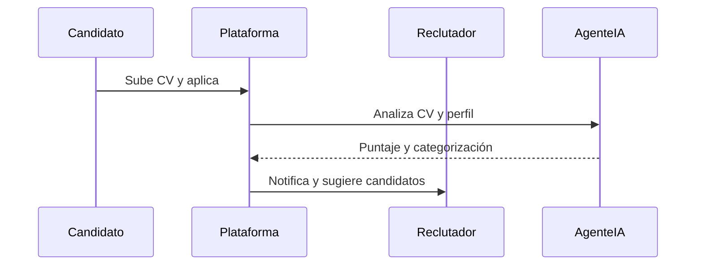
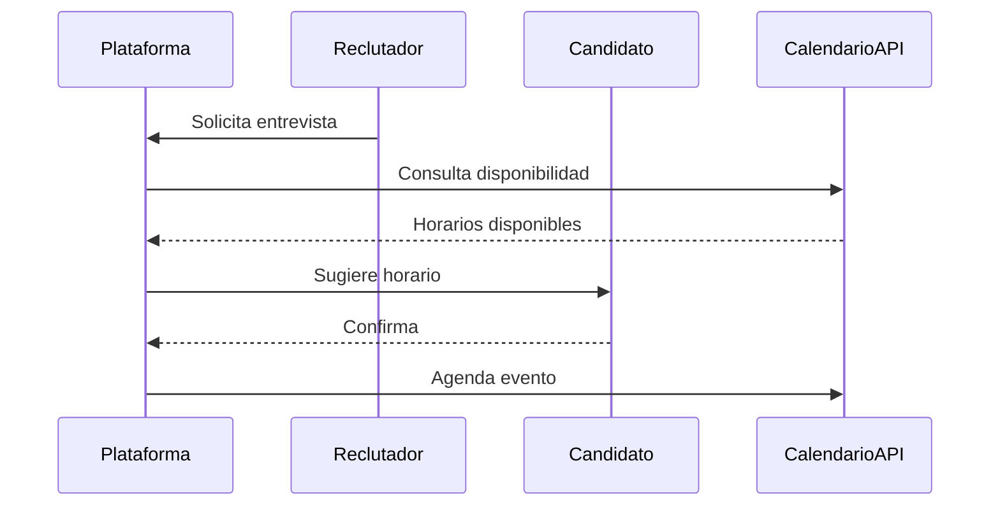
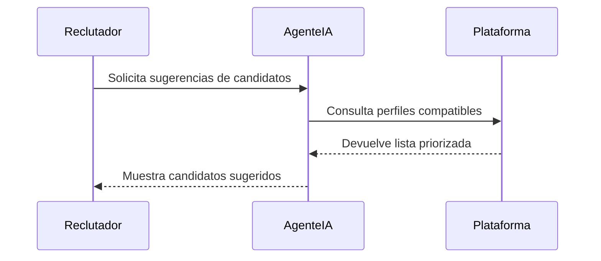
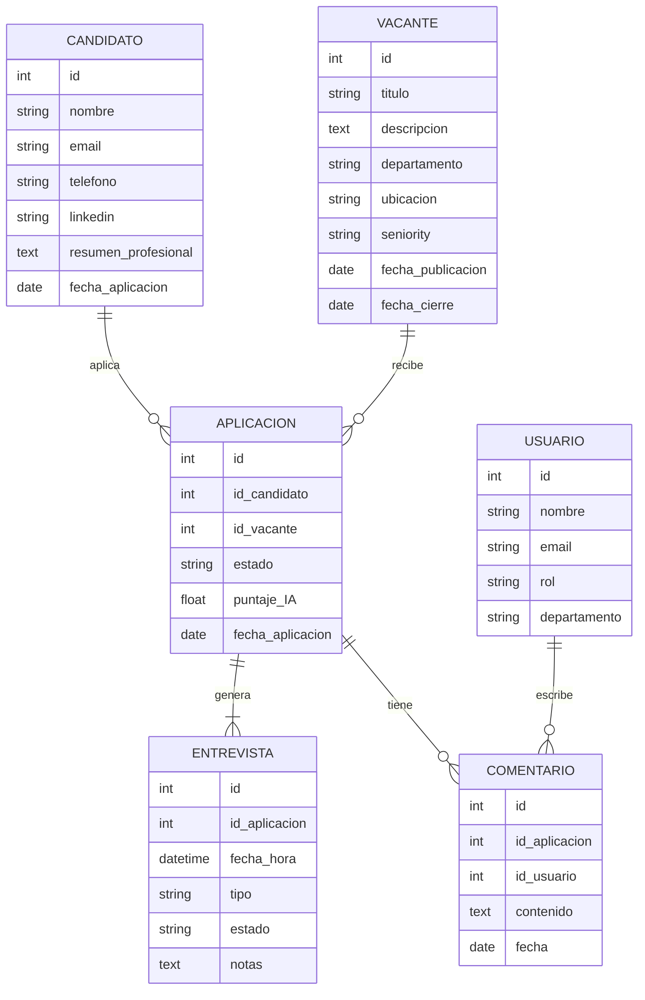
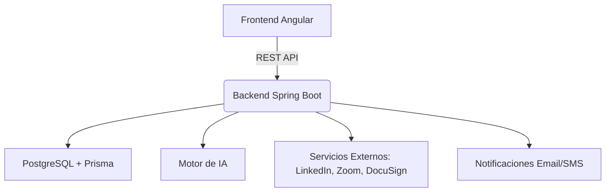
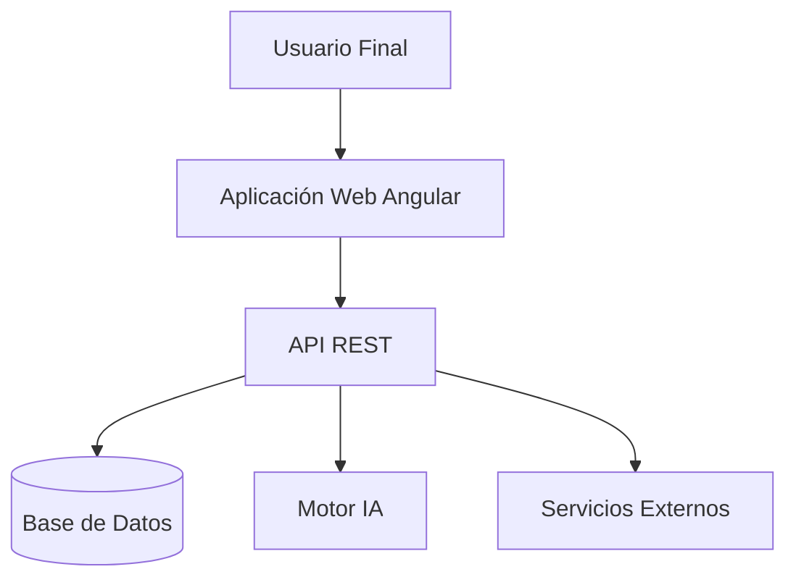
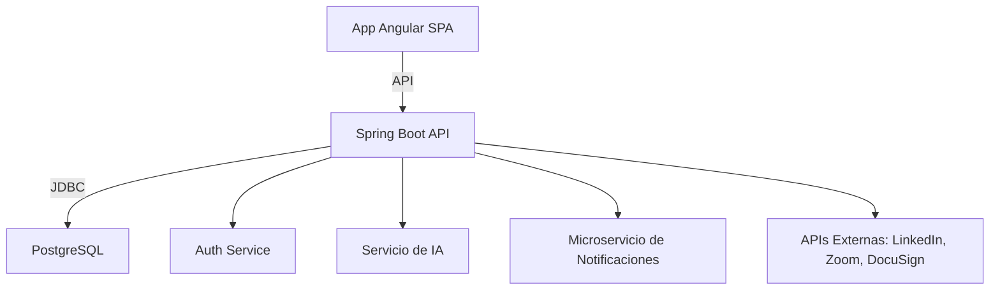
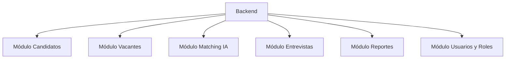

# 🦅 HawkeyeHire – Product Requirement Document (PRD)

## 🔹 1. ¿Qué es HawkeyeHire?

**HawkeyeHire** es un sistema ATS (Applicant Tracking System) de próxima generación diseñado desde cero para transformar el proceso de reclutamiento. Integra automatización avanzada, colaboración en tiempo real, inteligencia artificial y analítica de datos para proporcionar una plataforma moderna, intuitiva y poderosa.

Su enfoque innovador combina lo mejor de la tecnología con la experiencia humana, promoviendo decisiones de contratación más rápidas, justas y efectivas. Está orientado a empresas medianas y grandes que buscan optimizar la gestión de candidatos, mejorar la experiencia de usuario (UX) y aumentar la eficiencia del equipo de Recursos Humanos.

## 🔹 2. ¿Qué problemas del mercado aborda?

- Procesos manuales lentos y repetitivos
- Falta de colaboración entre reclutadores y gerentes
- Difícil seguimiento de candidatos
- Falta de analítica e insights procesables
- Mala experiencia para los candidatos
- Herramientas de IA poco integradas o poco confiables

## 🔹 3. ¿Cómo soluciona estos problemas HawkeyeHire?

- 🤖 **Automatización inteligente:** Screening automático de CVs, envío de correos, agendado de entrevistas.
- 📊 **Analítica y reportes en tiempo real:** Métricas clave como tiempo de contratación, fuentes de candidatos, desempeño de entrevistas.
- 🤝 **Colaboración multi-rol:** Sistema de comentarios, asignación de tareas, aprobación de perfiles.
- 🎯 **Matching asistido por IA:** Identificación automática de candidatos ideales según requisitos semánticos.
- 🧠 **Asistente virtual:** Chatbot integrado para apoyo a reclutadores y candidatos.
- 🎨 **Alta personalización:** Flujos y etapas de selección configurables por organización.

## 🔹 4. Roles

| Rol              | Descripción |
|------------------|-------------|
| 👤 Candidato     | Persona que aplica a una vacante. |
| 🧑‍💼 Reclutador  | Encargado de buscar, evaluar y gestionar candidatos. |
| 👔 Gerente de contratación | Toma decisiones finales, entrevista y aprueba contrataciones. |
| 🧠 Agente de IA   | Proporciona análisis, recomendaciones y automatizaciones inteligentes. |
| 🛠️ Administrador del sistema | Configura flujos, permisos y reglas del sistema. |

(continúa en el documento completo…)


## 🔹 5. Funcionalidades Principales

### 5.1 Publicación Multicanal de Vacantes
Permite la difusión simultánea de ofertas laborales en diversos portales de empleo y redes sociales desde una única interfaz centralizada.

### 5.2 Gestión Centralizada de Candidatos
Base de datos unificada con filtros inteligentes, historial de interacciones y seguimiento de cada etapa del proceso.

### 5.3 Filtro y Clasificación Automatizada de CVs
Utiliza algoritmos de IA para preevaluar, clasificar y puntuar los CVs basados en la descripción del puesto y habilidades requeridas.

### 5.4 Programación Automática de Entrevistas
Agendamiento inteligente basado en disponibilidad de los participantes, zonas horarias y tipo de entrevista.

### 5.5 Comunicación Omnicanal Automatizada
Sistema de notificaciones y correos automatizados configurables para mantener informados a los candidatos.

### 5.6 Analítica y Reportes en Tiempo Real
Dashboard con métricas clave como tiempo medio de contratación, tasa de abandono, desempeño por canal, entre otros.

## 🔹 6. Funcionalidades Innovadoras

### 6.1 Matching Semántico Asistido por IA
La IA analiza y correlaciona la descripción del puesto con perfiles disponibles considerando sinónimos, contexto y experiencia.

### 6.2 Asistente Virtual (Chatbot)
Atiende a candidatos y reclutadores con respuestas automatizadas, seguimiento de procesos, ayuda en entrevistas, etc.

### 6.3 Evaluaciones Automatizadas
Pruebas técnicas, de personalidad o de lógica integradas y generadas automáticamente por IA según el perfil buscado.

### 6.4 Integración con Redes Profesionales
Importación directa de perfiles desde LinkedIn, GitHub, etc., enriqueciendo automáticamente los perfiles en la base de datos.

### 6.5 Análisis Predictivo
Modelos ML que predicen rotación, desempeño estimado y éxito en la cultura organizacional.

### 6.6 Personalización de Experiencia
Contenido dinámico para cada candidato según su perfil, país, idioma y tipo de vacante.

## 🔹 7. Requisitos de Integración

- HRIS (ej. BambooHR, Workday)
- Sistemas de Nómina (ej. ADP, SAP SuccessFactors)
- Herramientas de firma electrónica (DocuSign, Adobe Sign)
- Entrevistas por video (Zoom, Teams, HireVue)
- Redes sociales y LinkedIn
- Plataformas de BI (Power BI, Looker)

## 🔹 8. Regulaciones y Cumplimiento

- GDPR (UE)
- CCPA (California)
- Normativas locales de protección de datos
- Seguridad basada en OWASP Top 10, cifrado en tránsito y en reposo, autenticación multifactor.

## 🔹 9. Escalabilidad y Usuarios Objetivo

### Escalabilidad
Arquitectura cloud-native basada en microservicios, balanceo de carga, contenedores con Kubernetes y autoscaling. Pensado desde MVP para escalar a volumen bancario.

### Usuarios Objetivo
- Equipos de Recursos Humanos corporativos
- Agencias de reclutamiento
- Consultoras de talento
- Gerentes de contratación en empresas medianas y grandes

## 🔹 10. Casos de Uso Principales

### Caso de Uso 1: Evaluación Automática de CVs



---

### Caso de Uso 2: Coordinación Inteligente de Entrevistas



---

### Caso de Uso 3: Asistencia al Reclutador vía IA



## 🔹 11. Modelo de Datos



Este modelo puede extenderse a medida que se integren nuevas funcionalidades como evaluaciones, tracking de actividad o procesos internos de aprobación.

## 🔹 12. Diseño del Sistema a Alto Nivel

El sistema está compuesto por microservicios desplegados en la nube, utilizando una arquitectura basada en DDD. Incluye frontend SPA (Angular), backend (Spring Boot), base de datos relacional (PostgreSQL) y motores de IA conectados.



## 🔹 13. Diagramas de Arquitectura C4

### Nivel 1: Contexto



### Nivel 2: Contenedores



### Nivel 3: Componentes



## 🔹 14. Análisis Competitivo

| Característica              | HawkeyeHire | Greenhouse | Lever | Workable |
|----------------------------|--------------|------------|-------|----------|
| Matching semántico IA      | ✅           | ❌         | ❌    | ❌       |
| Asistente virtual          | ✅           | ❌         | ❌    | ❌       |
| Publicación multicanal     | ✅           | ✅         | ✅    | ✅       |
| Reportes en tiempo real    | ✅           | ✅         | ✅    | ✅       |
| Evaluación automatizada    | ✅           | ❌         | ✅    | ❌       |
| Integración entrevistas    | ✅           | ✅         | ✅    | ✅       |
| Personalización profunda   | ✅           | ❌         | ❌    | ❌       |

---

## 🔹 15. Análisis de Riesgos

| Riesgo                             | Tipo        | Probabilidad | Impacto | Mitigación                                     |
|-----------------------------------|-------------|--------------|---------|------------------------------------------------|
| Falla en matching IA              | Técnico     | Media        | Alta    | Validación humana y aprendizaje continuo       |
| Baja adopción por UX compleja     | Negocio     | Media        | Media   | Diseño centrado en usuario y feedback temprano |
| Cumplimiento normativo deficiente | Legal       | Baja         | Alta    | Auditorías legales y consultoría externa       |
| Costo elevado de mantenimiento    | Económico   | Media        | Media   | Infraestructura optimizada y modular           |

---

## 🔹 16. Estrategia de Entrada al Mercado

- 🧪 Piloto con 3 empresas de tecnología en crecimiento
- 📣 Alianzas con agencias de reclutamiento
- 🛠️ Enfoque "bottom-up" dirigido a reclutadores y gerentes
- 🎯 Campañas en LinkedIn y ferias de talento
- 📊 Publicación de whitepapers y casos de éxito

---

## 🔹 17. Hoja de Ruta de Desarrollo

| Trimestre | Objetivo Principal                       |
|-----------|-------------------------------------------|
| Q1        | MVP funcional con flujos básicos          |
| Q2        | IA de matching + módulo entrevistas       |
| Q3        | Asistente virtual + reportes avanzados    |
| Q4        | Escalado cloud + integraciones externas   |

---

## 🔹 18. Estimación de Costos

```
+----------------------+-------------+
| Rubro                | Costo (USD) |
+----------------------+-------------+
| Desarrollo (equipo)  | 120,000     |
| Infraestructura Cloud| 25,000      |
| Licencias & APIs     | 10,000      |
| UX/UI & diseño       | 15,000      |
| Marketing inicial    | 20,000      |
| Soporte & legales    | 10,000      |
+----------------------+-------------+
| Total                | 200,000     |
+----------------------+-------------+
```

---

## 🔹 19. Stack de Implementación Técnica

- **Frontend:** Angular
- **Backend:** Spring Boot (Java 17)
- **ORM / DB:** Prisma con PostgreSQL
- **Testing:** Playwright (E2E)
- **Arquitectura:** DDD + microservicios
- **IA/ML:** Scikit-learn, spaCy, HuggingFace
- **DevOps:** Docker, Kubernetes, GitHub Actions, Terraform
- **Monitorización:** Prometheus + Grafana

---

## 🤖 Diferenciador Clave: Inteligencia Artificial

- Clasificación y preselección inteligente
- Matching semántico entre perfiles y vacantes
- Asistente virtual multicanal
- Reportes predictivos y recomendaciones de mejora
