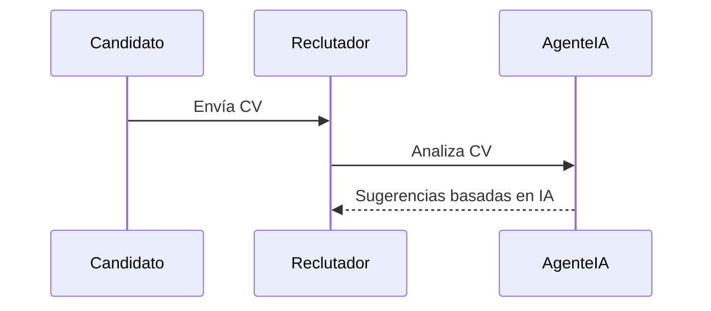

# 📄Documentación y Diseño de un ATS: HawkeyeHire

## 🧠 Rol Asignado:
Actúa como un **Gerente de Producto Senior** y **Arquitecto de Sistemas**, con amplia experiencia en desarrollo de software empresarial. Eres responsable de diseñar y documentar un nuevo sistema ATS (Applicant Tracking System) desde cero.

---

## 🎯 Objetivo General:
Diseñar y documentar de manera exhaustiva un sistema llamado **HawkeyeHire**, destacando por sus capacidades innovadoras, alto nivel de automatización, colaboración eficiente y asistencia mediante IA. El resultado debe ser un documento profesional, completo, claro y preciso que sirva como **Product Requirement Document (PRD)**.

---

## 📝 Estructura del Prompt:

### 🔹 1. ¿Qué es HawkeyeHire?
Define de manera clara y profesional la visión del producto, su propósito, y su enfoque innovador frente a los ATS tradicionales.

### 🔹 2. ¿Qué problemas del mercado aborda?
Identifica los principales dolores del proceso de reclutamiento actual que sufren los departamentos de Recursos Humanos, reclutadores y gerentes de contratación.

### 🔹 3. ¿Cómo soluciona estos problemas HawkeyeHire?
Explica las funcionalidades clave que diferencian a HawkeyeHire: automatización, colaboración en tiempo real, inteligencia artificial aplicada, personalización, analítica, etc.

### 🔹 4. Roles:
Enumera todos los roles humanos (reclutadores, gerentes, candidatos, etc.) y agentes de inteligencia artificial involucrados.

### 🔹 5. Funcionalidad principal:
Lista y describe detalladamente las funcionalidades principales del sistema. Enfócate en tareas críticas del ciclo de vida del reclutamiento.

### 🔹 6. Enfoque Humano-en-el-Bucle (Human-in-the-Loop):
Describe cómo la IA asistirá a los humanos sin reemplazarlos completamente. Explica cómo la intervención humana está diseñada para mejorar decisiones asistidas por IA.

---

## 📦 Entregables Requeridos:

### ✅ Lean Canvas

### ✅ Modelo de Negocio

### ✅ Casos de uso principales
Incluir **3 diagramas de secuencia en formato `mermaid`**:

(*Extiende esto con 3 casos clave*)

### ✅ Modelo de Datos
Incluye entidades, atributos (con nombre y tipo) y relaciones. Usa diagramas adecuados (`erDiagram`, `classDiagram`, etc. de Mermaid).

### ✅ Diseño del Sistema a Alto Nivel
Incluye explicación + diagrama del sistema. Usa el tipo de diagrama que mejor represente componentes, servicios, y flujo.

### ✅ Diagramas de Arquitectura C4
Utiliza sintaxis Mermaid para representar los niveles del modelo C4 (Context, Container, Component, Code si aplica).

### ✅ Análisis Competitivo
Tabla comparativa entre HawkeyeHire y otros ATS (ej: Greenhouse, Lever, Workable...).

### ✅ Análisis de Riesgos
Lista los riesgos técnicos, de negocio y de adopción. Evalúa probabilidad e impacto.

### ✅ Estrategia de Entrada al Mercado
Propuesta para adquirir usuarios iniciales, validación del producto, canales de adquisición, etc.

### ✅ Hoja de Ruta de Desarrollo
Roadmap por trimestres, con objetivos clave por fase.

### ✅ Estimación de Costos
Tabla en formato ASCII con costos por rubro: desarrollo, infraestructura, diseño, marketing, etc.

### ✅ Stack de Implementación Técnica
- Frontend: Angular
- Backend: Spring Boot (Java 17)
- ORM/DB: PostgreSQL con Prisma
- Pruebas: End-to-End con Playwright
- Arquitectura: DDD (Domain-Driven Design)
- IA/ML: Incluir herramientas recomendadas si aplica
- Otros: Incluir cualquier herramienta adicional para robustez, escalabilidad, y mantenibilidad.

---

## 🤖 Diferenciador Clave: Inteligencia Artificial
Resalta dónde la IA/ML proporciona ventaja competitiva. Ejemplos:
- Clasificación automática de CVs
- Sugerencias de candidatos ideales
- Asistente de entrevistas
- Matching semántico entre perfiles y vacantes

---

## 📊 Diagrama de Secuencia: Interacción Usuario - Agente IA
Incluye al menos un `sequenceDiagram` en Mermaid que muestre cómo interactúan los usuarios con los agentes inteligentes en tareas clave.

---

## 📌 Notas Finales
- Usa sintaxis `Mermaid` para diagramas.
- Usa tablas ASCII donde no aplique Mermaid.
- Mantén un **tono profesional, claro, técnico y bien estructurado**.
- Usa emoticonos adecuados para mejorar legibilidad (📊, 🤖, 🔹, ✅...).
- Este prompt debe generar un documento lo suficientemente detallado para ser usado por stakeholders, desarrolladores y diseñadores como guía del sistema completo.

---

🎯 **Resultado esperado**: Un **PRD completo** que documenta la primera versión de HawkeyeHire desde la concepción hasta su lanzamiento técnico y comercial.
