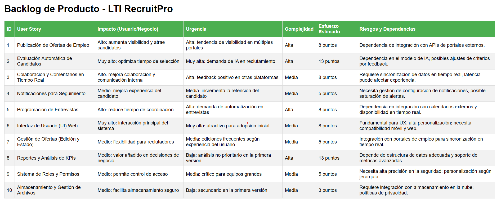

# User Stories

## 1. Publicación de Ofertas de Empleo

**Formato estándar:**
*Como reclutador, quiero publicar una oferta de empleo en múltiples portales para aumentar la visibilidad de la oferta y atraer candidatos adecuados.*

**Descripción:**
El reclutador puede crear y publicar una oferta de empleo, especificando detalles clave como el título, la descripción, los requisitos y el salario. Esta oferta se publica en múltiples portales de empleo de manera automatizada.

**Criterios de Aceptación:**

- **Dado que** el reclutador ha completado todos los campos requeridos para la oferta, **cuando** haga clic en "Publicar oferta", **entonces** la oferta se publicará en los portales seleccionados.
- **Dado que** el reclutador desea modificar la oferta publicada, **cuando** haga clic en "Editar" y guarde los cambios, **entonces** las actualizaciones se reflejarán en todos los portales.

**Notas adicionales:**
- Considerar una integración con LinkedIn, Indeed, y otras plataformas relevantes, asegurando que los datos se sincronicen correctamente.

**Tareas:**

- Crear la interfaz para el formulario de creación de ofertas.
- Implementar la lógica de publicación y sincronización con portales externos.
- Probar la funcionalidad para garantizar la correcta actualización en los portales.
- Desarrollar notificaciones de éxito o error en el proceso de publicación.

## 2. Evaluación Automática de Candidatos

**Formato estándar:**
*Como reclutador, quiero que el sistema evalúe automáticamente los currículums para identificar rápidamente a los candidatos más adecuados.*

**Descripción:**
La IA analiza los currículums y asigna una puntuación a cada candidato en función de los requisitos de la oferta. Esto permite al reclutador centrarse en los perfiles con mayor coincidencia.

**Criterios de Aceptación:**

- **Dado que** el sistema recibe un nuevo currículum, **cuando** se complete la carga, **entonces** la IA evaluará automáticamente el currículum y asignará una puntuación al candidato.
- **Dado que** un reclutador revisa la lista de candidatos para una oferta, **cuando** consulta el perfil de un candidato, **entonces** verá la puntuación generada por la IA para ese perfil.

**Notas adicionales:**
- Considerar la capacidad de personalizar los criterios de evaluación en función del tipo de puesto y nivel de experiencia deseado.

**Tareas:**

- Integrar el servicio de IA para evaluación de currículums.
- Definir los criterios de puntuación iniciales y ajustar según la oferta de empleo.
- Probar la precisión de las evaluaciones y ajustar el algoritmo según el feedback.
- Añadir la visualización de la puntuación en el perfil del candidato.

## 3. Colaboración y Comentarios en Tiempo Real

**Formato estándar:**
*Como reclutador o manager, quiero agregar comentarios sobre los candidatos para compartir opiniones y coordinar mejor con mi equipo.*

**Descripción:**
El reclutador o manager puede agregar comentarios en tiempo real a los perfiles de los candidatos. Otros miembros del equipo pueden ver estos comentarios, lo que facilita la colaboración en la evaluación de candidatos.

**Criterios de Aceptación:**

- **Dado que** un reclutador o manager visualiza el perfil de un candidato, **cuando** escribe un comentario y hace clic en "Enviar", **entonces** el comentario se mostrará en tiempo real para otros miembros del equipo.
- **Dado que** un usuario revisa el perfil de un candidato, **cuando** ve un comentario existente, **entonces** podrá responder al comentario para añadir su opinión.

**Notas adicionales:**
- El sistema debe actualizar en tiempo real los comentarios para evitar inconsistencias en la colaboración.

**Tareas:**

- Crear la funcionalidad de comentarios en tiempo real en el perfil del candidato.
- Implementar actualizaciones automáticas para que los comentarios sean visibles sin recargar la página.
- Probar la sincronización de comentarios en tiempo real entre diferentes usuarios.
- Asegurar que los comentarios son visibles únicamente para usuarios autorizados.

## 4. Notificaciones para Seguimiento de Candidatos

**Formato estándar:**
*Como candidato, quiero recibir notificaciones sobre el estado de mi solicitud para saber en qué fase del proceso de selección me encuentro.*

**Descripción:**
El sistema envía notificaciones a los candidatos cada vez que su solicitud cambia de estado (por ejemplo, de "Aplicado" a "Entrevistado"). Esto ayuda a los candidatos a mantenerse informados y reduce la incertidumbre.

**Criterios de Aceptación:**

- **Dado que** un candidato tiene una solicitud activa, **cuando** el reclutador actualiza el estado de su solicitud, **entonces** el sistema enviará una notificación al candidato.
- **Dado que** el sistema notifica a un candidato sobre una entrevista, **cuando** la notificación sea enviada, **entonces** el candidato recibirá un recordatorio el día anterior a la entrevista.

**Notas adicionales:**
- Incluir recordatorios automáticos para entrevistas y otras fases críticas del proceso de selección.

**Tareas:**

- Configurar el sistema de notificaciones automáticas para cambios de estado.
- Integrar recordatorios de entrevistas con el sistema de calendario.
- Probar las notificaciones en diferentes estados y para distintos eventos.
- Añadir la opción de configuración de notificaciones para los candidatos.

## 5. Programación de Entrevistas

**Formato estándar:**
*Como reclutador, quiero programar entrevistas automáticamente en función de la disponibilidad del candidato para ahorrar tiempo y reducir errores en la coordinación.*

**Descripción:**
El sistema permite al reclutador programar entrevistas automáticamente utilizando la disponibilidad de los candidatos y del equipo, coordinando con herramientas de calendario externas.

**Criterios de Aceptación:**

- **Dado que** el reclutador selecciona un candidato para entrevista, **cuando** elija la opción de "Programar entrevista", **entonces** el sistema verificará las disponibilidades y propondrá fechas posibles.
- **Dado que** el sistema propone una fecha de entrevista, **cuando** el candidato confirme la fecha, **entonces** el sistema enviará la confirmación al reclutador y al equipo de entrevistas.

**Notas adicionales:**
- Incluir la opción de ver la disponibilidad en tiempo real y enviar invitaciones a través de servicios de calendario.

**Tareas:**

- Configurar la integración con servicios de calendario (Google Calendar, Outlook).
- Crear la interfaz de selección de fecha y verificación de disponibilidad.
- Implementar la lógica de confirmación de entrevista y envío de invitaciones.
- Probar la funcionalidad de programación automática con diferentes escenarios de disponibilidad.


# Backlog


Para generar el backlog, se ha utilizado el siguiente prompt, se ha trabajado sobre el chat usado en la sesión 3 en donde 
se crearon los funcionalidades, casos de uso, modelos de datos y relaciones entre entidades.

```
Arma el Backlog de producto con las User Stories Estima por cada item en el backlog (genera una tabla markdown):

Impacto en el usuario y valor del negocio.
Urgencia basada en tendencias del mercado y feedback de usuarios.
Complejidad y esfuerzo estimado de implementación.
Riesgos y dependencias entre tareas. 
```

```
Me podaras darlo para insertarlo en un file md?
```

```
Que otro formato podrias brindarmelo por que en md se ve muy desordenado
```

```
Un html esta bien
```

** Conclusiones **

Al reunir los datos de los chats, me ha permitido crear el backlog de producto, el cual se puede visualizar en el archivo backlog.html
Al no perder el contexto el chat puedo elaborar el backlog de manera más precisa y de esta manera tener un mejor entendimiento de las necesidades del usuario y del negocio.



# TICKET DE TRABAJO 

**Ticket 1: Creación de Formulario de Publicación de Ofertas**

**Título:** Creación de formulario de publicación de ofertas de empleo

**Descripción:**
Diseñar e implementar un formulario de creación de ofertas en la interfaz de usuario. Este formulario debe permitir a los reclutadores ingresar detalles de la oferta, como título, descripción, requisitos, rango salarial, y ubicación. El formulario debe incluir validación de campos requeridos.

**Criterios de Aceptación:**

- **Dado que** el reclutador accede al módulo de creación de ofertas, **cuando** complete todos los campos y haga clic en "Guardar", **entonces** el sistema almacenará la oferta en estado de "Borrador".
- **Dado que** el reclutador complete los campos requeridos de la oferta, **cuando** intente enviar el formulario con un campo vacío, **entonces** el sistema mostrará un mensaje de error indicando el campo faltante.

**Prioridad:** Alta

**Estimación:** 5 puntos

**Asignado a:** Equipo de Frontend

**Etiquetas:** Frontend, Formulario, Ofertas

---

**Ticket 2: Sincronización de Ofertas en Portales Externos**

**Título:** Sincronización de ofertas de empleo con portales externos

**Descripción:**
Implementar la lógica de sincronización para que las ofertas de empleo creadas en el sistema se publiquen automáticamente en portales de empleo externos seleccionados. La sincronización debe incluir LinkedIn, Indeed, y otros portales populares.

**Criterios de Aceptación:**

- **Dado que** el reclutador selecciona los portales externos al publicar una oferta, **cuando** haga clic en "Publicar", **entonces** el sistema sincronizará los datos de la oferta en los portales seleccionados.
- **Dado que** la sincronización falle, **cuando** el sistema detecte un error de publicación, **entonces** debe mostrar un mensaje al reclutador indicando el portal afectado y permitir reintentar la publicación.

**Prioridad:** Muy Alta

**Estimación:** 8 puntos

**Asignado a:** Equipo de Backend

**Etiquetas:** Backend, Integración, Portales Externos

---

**Ticket 3: Interfaz de Estado y Modificación de Ofertas Publicadas**

**Título:** Implementación de interfaz para estado y modificación de ofertas publicadas

**Descripción:**
Crear una interfaz para que los reclutadores puedan ver el estado actual de cada oferta y modificar detalles de ofertas ya publicadas. Al modificar una oferta, los cambios deben actualizarse en tiempo real en los portales externos.

**Criterios de Aceptación:**

- **Dado que** el reclutador accede al módulo de ofertas publicadas, **cuando** seleccione una oferta en estado "Publicado", **entonces** verá una opción para editar y actualizar los detalles de la oferta.
- **Dado que** el reclutador realiza una modificación en una oferta publicada, **cuando** haga clic en "Guardar Cambios", **entonces** el sistema debe actualizar la información en los portales seleccionados.

**Prioridad:** Alta

**Estimación:** 8 puntos

**Asignado a:** Equipo de Frontend y Backend

**Etiquetas:** Frontend, Backend, Ofertas, Sincronización

---

**Ticket 4: Notificación de Publicación Exitosa o Fallida**

**Título:** Notificación de publicación exitosa o fallida en portales externos

**Descripción:**
Desarrollar notificaciones para que el reclutador reciba un mensaje de confirmación cuando una oferta de empleo se publique correctamente en los portales externos. En caso de falla, debe mostrarse un mensaje con detalles del portal afectado y una opción para reintentar.

**Criterios de Aceptación:**

- **Dado que** la oferta de empleo se haya publicado correctamente, **cuando** el sistema confirme la publicación, **entonces** el reclutador recibirá una notificación de éxito.
- **Dado que** la publicación falle en algún portal, **cuando** el sistema detecte el error, **entonces** el reclutador verá una notificación con detalles del error y la opción de reintentar.

**Prioridad:** Media

**Estimación:** 5 puntos

**Asignado a:** Equipo de Backend y Notificaciones

**Etiquetas:** Backend, Notificaciones, Errores

---

**Ticket 5: Pruebas de Funcionalidad de Publicación**

**Título:** Pruebas de funcionalidad de publicación de ofertas de empleo

**Descripción:**
Realizar pruebas de la funcionalidad completa de publicación de ofertas, incluyendo creación, edición, y sincronización con portales externos. Las pruebas deben validar la publicación correcta en todos los portales y manejar posibles errores de sincronización.

**Criterios de Aceptación:**

- **Dado que** una oferta de empleo ha sido publicada, **cuando** el equipo de pruebas valide en los portales externos, **entonces** la información debe coincidir con los datos ingresados en el sistema.
- **Dado que** un error ocurra en el proceso de publicación, **cuando** se realicen pruebas de reintento, **entonces** el sistema debe permitir reintentar la publicación hasta que sea exitosa.

**Prioridad:** Alta

**Estimación:** 5 puntos

**Asignado a:** Equipo de QA

**Etiquetas:** QA, Pruebas, Publicación

# Estimación de puntos

Ticket	Título	Estimación (Puntos de Historia - Fibonacci)
Ticket 1	Creación de Formulario de Publicación de Ofertas	5 puntos
Ticket 2	Sincronización de Ofertas en Portales Externos	8 puntos
Ticket 3	Interfaz de Estado y Modificación de Ofertas Publicadas	8 puntos
Ticket 4	Notificación de Publicación Exitosa o Fallida	5 puntos
Ticket 5	Pruebas de Funcionalidad de Publicación	5 puntos
