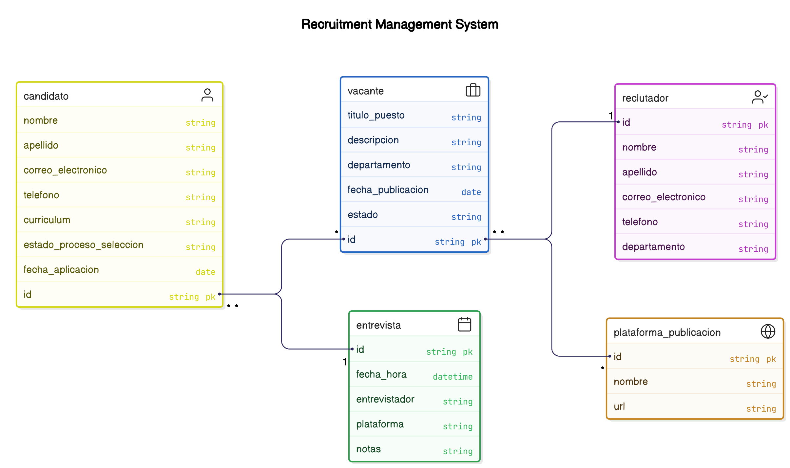

# TalentFlow: Sistema de Seguimiento de Candidatos

## Descripción Breve
TalentFlow es un sistema de seguimiento de candidatos (ATS) diseñado para revolucionar el proceso de reclutamiento mediante el uso de inteligencia artificial y análisis predictivo. Nuestro software está orientado a mejorar la eficiencia del reclutamiento, promover la diversidad y ofrecer una experiencia de usuario excepcional tanto para los reclutadores como para los candidatos.

## Valor Añadido y Ventajas Competitivas
- **Eliminación de Sesgos:** Utilizamos algoritmos avanzados de IA para identificar y eliminar sesgos en el proceso de selección, promoviendo la diversidad e inclusión en las contrataciones.
- **Experiencia Personalizada:** Ofrecemos portales personalizados para candidatos que proporcionan recomendaciones de empleo basadas en sus perfiles y preferencias.
- **Integración Fluida:** TalentFlow se integra perfectamente con herramientas de colaboración como Slack y Microsoft Teams, facilitando la comunicación y colaboración entre los equipos de reclutamiento.
- **Análisis Predictivo:** Nuestras herramientas de análisis predictivo ayudan a predecir el éxito potencial de los candidatos, mejorando la calidad de las contrataciones.

## Funciones Principales
- **Gestión de Candidatos:** Almacenamiento y organización de perfiles de candidatos con capacidades de búsqueda avanzada.
- **Publicación de Vacantes:** Publicación automática en múltiples plataformas de empleo y redes sociales.
- **Filtrado Inteligente:** Uso de IA para filtrar y clasificar candidatos, reduciendo el tiempo de selección.
- **Programación de Entrevistas:** Integración con calendarios corporativos para facilitar la programación de entrevistas.
- **Comunicación Automatizada:** Envío de correos electrónicos automáticos para mantener a los candidatos informados durante todo el proceso.
- **Movilidad y Accesibilidad:** Aplicación móvil que permite a los reclutadores gestionar el proceso de selección desde cualquier lugar.

## Lean Canvas de TalentFlow

1. **Problema:**
   - Sesgos en el proceso de selección que afectan la diversidad.
   - Procesos de reclutamiento ineficientes y lentos.
   - Falta de integración con herramientas de colaboración.

2. **Segmento de Clientes:**
   - Empresas medianas que buscan mejorar la eficiencia de su reclutamiento.
   - Departamentos de RRHH que priorizan la diversidad e inclusión.
   - Reclutadores que necesitan herramientas móviles y accesibles.

3. **Propuesta de Valor Única:**
   - Eliminación de sesgos mediante IA avanzada.
   - Experiencia personalizada para candidatos y reclutadores.
   - Integración fluida con herramientas de colaboración.

4. **Solución:**
   - Algoritmos de IA para eliminar sesgos.
   - Portales personalizados y recomendaciones de empleo.
   - Integración con Slack y Microsoft Teams.

5. **Canales:**
   - Ventas directas a través de un equipo comercial especializado.
   - Asociaciones con consultoras de RRHH.
   - Marketing digital y presencia en ferias de tecnología de RRHH.

6. **Flujo de Ingresos:**
   - Modelo de suscripción basado en el número de usuarios.
   - Servicios adicionales de consultoría y soporte premium.

7. **Estructura de Costos:**
   - Desarrollo y mantenimiento de software.
   - Costos de marketing y ventas.
   - Investigación y desarrollo para mejoras continuas.

8. **Métricas Clave:**
   - Tasa de adopción de nuevas funcionalidades.
   - Retención de clientes y Net Promoter Score (NPS).
   - ROI del cliente en términos de eficiencia operativa.

9. **Ventaja Competitiva:**
   - Uso de IA para mejorar la diversidad y la calidad de las contrataciones.
   - Experiencia de usuario superior y personalización.
   - Integración con herramientas de colaboración líderes. 

## Principales Casos de Uso de TalentFlow

### 1. Publicación de Vacantes
**Descripción:** Permitir a los reclutadores publicar ofertas de trabajo en múltiples plataformas de empleo y redes sociales desde una única interfaz.
**Beneficio:** Simplifica el proceso de publicación de vacantes y aumenta la visibilidad de las ofertas de empleo.

### 2. Gestión de Candidatos
**Descripción:** Almacenar y organizar la información de los candidatos, incluyendo currículums y notas de entrevistas, en un sistema centralizado.
**Beneficio:** Facilita el acceso a la información de los candidatos y mejora la organización del proceso de selección.

### 3. Programación de Entrevistas
**Descripción:** Integrar con calendarios corporativos para coordinar y programar entrevistas de manera eficiente.
**Beneficio:** Reduce el tiempo y esfuerzo necesarios para coordinar entrevistas, mejorando la eficiencia del proceso de selección.

## Modelo de Datos de TalentFlow

### Entidades y Atributos

1. **Candidato**
     - ID del Candidato
     - Nombre
     - Apellido
     - Correo Electrónico
     - Teléfono
     - Currículum (URL o archivo)
     - Estado del Proceso de Selección
     - Fecha de Aplicación

2. **Vacante**
     - ID de la Vacante
     - Título del Puesto
     - Descripción
     - Departamento
     - Fecha de Publicación
     - Estado (Abierta, Cerrada, etc.)

3. **Entrevista**
     - ID de la Entrevista
     - Fecha y Hora
     - Entrevistador
     - Plataforma (Presencial, Zoom, etc.)
     - Notas de la Entrevista

4. **Reclutador**
     - ID del Reclutador
     - Nombre
     - Apellido
     - Correo Electrónico
     - Teléfono
     - Departamento

5. **Plataforma de Publicación**
     - ID de la Plataforma
     - Nombre
     - URL

### Diagrama E/R

## Arquitectura del Sistema

### Visión General
La arquitectura de TalentFlow está basada en microservicios, una aproximación que permite el desarrollo, despliegue y escalado independiente de cada componente del sistema. Esta arquitectura facilita la evolución del producto, mejora la resiliencia y permite un escalado preciso según las necesidades de cada funcionalidad.

### Componentes Principales

1. **Frontend**
   - **Aplicación Web:** Desarrollada con frameworks modernos como React o Angular, siguiendo principios de diseño responsivo.
   - **Aplicación Móvil:** Versiones nativas para iOS y Android que permiten a los reclutadores trabajar desde cualquier lugar.
   
2. **API Gateway**
   - Punto de entrada único para todas las peticiones al backend.
   - Implementa funciones de enrutamiento, autenticación, autorización y limitación de tasa.
   - Ofrece documentación automática de API mediante estándares como OpenAPI.

3. **Microservicios**

   - **Gestión de Candidatos:**
     - **Responsabilidad:** Manejar toda la información relacionada con los candidatos.
     - **Funcionalidades:** Registro de candidatos, actualización de perfiles, búsqueda avanzada, filtrado por habilidades.
     - **Datastore:** Base de datos relacional optimizada para consultas complejas y búsquedas.
     - **Patrones de Diseño:** Repository pattern, CQRS para separar consultas de comandos.

   - **Publicación de Vacantes:**
     - **Responsabilidad:** Gestionar la creación, publicación y seguimiento de vacantes.
     - **Funcionalidades:** Creación de plantillas de vacantes, publicación multi-canal, seguimiento de desempeño de publicaciones.
     - **Datastore:** Base de datos NoSQL para manejar estructuras flexibles de vacantes adaptadas a diferentes plataformas.
     - **Patrones de Diseño:** Publisher-Subscriber para notificaciones de nuevas vacantes.

   - **Reclutamiento:**
     - **Responsabilidad:** Coordinar el proceso de selección.
     - **Funcionalidades:** Programación de entrevistas, gestión de feedback, automatización de comunicaciones con candidatos.
     - **Datastore:** Base de datos relacional con capacidades de programación temporal.
     - **Patrones de Diseño:** Workflow pattern para gestionar el flujo del proceso de reclutamiento.

   - **Análisis y Reportes:**
     - **Responsabilidad:** Proveer análisis y reportes sobre el proceso de reclutamiento.
     - **Funcionalidades:** Dashboards personalizados, métricas de rendimiento, análisis predictivo de candidatos.
     - **Datastore:** Data warehouse para análisis de grandes volúmenes de datos históricos.
     - **Patrones de Diseño:** CQRS con vistas materializadas para consultas de rendimiento optimizado.

   - **Integración y Colaboración:**
     - **Responsabilidad:** Facilitar la integración con herramientas externas.
     - **Funcionalidades:** Conectores para Slack, Microsoft Teams, calendarios, email, etc.
     - **Datastore:** Base de datos ligera para almacenar configuraciones de integración.
     - **Patrones de Diseño:** Adapter pattern para conectar con sistemas externos.

4. **Comunicación entre Microservicios**
   - **Comunicación Síncrona:** APIs REST o GraphQL para operaciones que requieren respuesta inmediata.
   - **Comunicación Asíncrona:** Sistema de mensajería basado en eventos para operaciones que no requieren respuesta inmediata.
   - **Event Bus:** Facilita la publicación y suscripción a eventos entre microservicios.

5. **Servicios Transversales**
   - **Autenticación y Autorización:** Sistema centralizado de gestión de identidades y accesos.
   - **Logging y Monitorización:** Recopilación centralizada de logs y métricas para diagnóstico y alertas.
   - **Cache Distribuida:** Mejora del rendimiento mediante caché de datos frecuentemente accedidos.
   - **Gestión de Configuración:** Servicio centralizado de configuración para todos los microservicios.

### Consideraciones Técnicas

1. **Escalabilidad:**
   - Arquitectura horizontal que permite escalar cada microservicio independientemente según su carga.
   - Uso de balanceadores de carga para distribuir el tráfico.
   - CDN para entregar contenido estático con baja latencia a nivel global.

2. **Resiliencia:**
   - Implementación de Circuit Breaker para prevenir fallos en cascada.
   - Mecanismos de retry con backoff exponencial para operaciones fallidas.
   - Almacenamiento en caché para reducir dependencias entre servicios.

3. **Seguridad:**
   - Autenticación mediante tokens JWT o OAuth 2.0.
   - Cifrado de datos sensibles en tránsito y en reposo.
   - Validación de entrada para prevenir inyecciones y otros ataques.
   - Escaneo continuo de vulnerabilidades en código y dependencias.

4. **DevOps & CI/CD:**
   - Pipelines automatizados para integración y despliegue continuo.
   - Infraestructura como código para provisionar y gestionar entornos.
   - Contenedores Docker para garantizar consistencia entre entornos.
   - Orquestación con Kubernetes para gestión de contenedores.

5. **Observabilidad:**
   - Tracing distribuido para monitorizar el flujo de peticiones entre servicios.
   - Métricas de rendimiento y uso de recursos.
   - Dashboards operacionales y alertas automáticas.

### Infraestructura en Azure Cloud

Para implementar la arquitectura de TalentFlow en Azure Cloud, utilizaremos los siguientes servicios que se alinean perfectamente con nuestra arquitectura de microservicios:

1. **Contenedores y Orquestación**
   - **Azure Kubernetes Service (AKS):** Implementación de todos los microservicios en contenedores, permitiendo escalabilidad, alta disponibilidad y gestión simplificada de la infraestructura.
   - **Azure Container Registry (ACR):** Almacenamiento y gestión de imágenes Docker para nuestros microservicios.

2. **API Management**
   - **Azure API Management:** Implementación del API Gateway, proporcionando funcionalidades como autenticación, limitación de tasa, documentación de API y análisis de uso.

3. **Bases de Datos**
   - **Azure SQL Database:** Para los microservicios de Gestión de Candidatos y Reclutamiento que requieren bases de datos relacionales.
   - **Azure Cosmos DB:** Para el microservicio de Publicación de Vacantes, aprovechando su naturaleza NoSQL y capacidad de escalado global.
   - **Azure Synapse Analytics:** Para el microservicio de Análisis y Reportes, permitiendo análisis de datos a gran escala.
   - **Azure Table Storage:** Para el microservicio de Integración y Colaboración, ofreciendo almacenamiento ligero para configuraciones.

4. **Comunicación entre Microservicios**
   - **Azure Service Bus:** Implementación del Event Bus para comunicación asíncrona entre microservicios.
   - **Azure Event Grid:** Para la arquitectura basada en eventos, facilitando la notificación de eventos entre microservicios.

5. **Frontend**
   - **Azure Static Web Apps:** Para alojar la aplicación web frontend con integración directa a GitHub para CI/CD.
   - **Azure App Service:** Para componentes dinámicos del frontend que requieran procesamiento en el servidor.

6. **Redes y Entrega de Contenido**
   - **Azure Front Door:** Combinación de CDN, balanceo de carga y protección contra ataques.
   - **Azure CDN:** Para entregar contenido estático con baja latencia.

7. **Seguridad**
   - **Azure Active Directory (AAD):** Gestión de identidades y accesos para usuarios y aplicaciones.
   - **Azure Key Vault:** Almacenamiento seguro de secretos, claves y certificados.
   - **Azure Security Center:** Monitorización continua de seguridad.

8. **Observabilidad**
   - **Azure Monitor:** Recopilación centralizada de métricas y logs.
   - **Application Insights:** Supervisión detallada de la aplicación, incluyendo tracing distribuido.
   - **Azure Log Analytics:** Análisis avanzado de logs para identificar problemas y tendencias.

9. **DevOps**
   - **Azure DevOps:** Pipelines de CI/CD para automatizar la compilación, pruebas y despliegue.
   - **Azure Resource Manager (ARM):** Infraestructura como código para aprovisionamiento consistente.

10. **Inteligencia Artificial**
    - **Azure Cognitive Services:** Para implementar las capacidades de IA, como análisis de currículos y eliminación de sesgos.
    - **Azure Machine Learning:** Para modelos predictivos que evalúan la adecuación de candidatos a puestos específicos.

Esta implementación en Azure Cloud proporciona todas las capacidades necesarias para operar TalentFlow de manera escalable, segura y con alto rendimiento, aprovechando las características gestionadas de la nube para reducir la carga operativa y permitir que el equipo se centre en añadir valor al producto.

## Diagramas C4 del Microservicio de Gestión de Candidatos

El modelo C4 nos permite visualizar la arquitectura de software a diferentes niveles de abstracción. A continuación, se presentan los diagramas C4 para el Microservicio de Gestión de Candidatos, llegando hasta el nivel 4 (nivel de código).

### Nivel 1: Diagrama de Contexto del Sistema

Este diagrama muestra TalentFlow en el contexto de sus usuarios y sistemas externos con los que interactúa.

### Nivel 2: Diagrama de Contenedores

Este diagrama muestra los principales contenedores (aplicaciones, almacenes de datos, etc.) que componen TalentFlow.

### Nivel 3: Diagrama de Componentes del Microservicio de Gestión de Candidatos

Este diagrama muestra los principales componentes que conforman el Microservicio de Gestión de Candidatos.

### Nivel 4: Diagrama de Código del Componente Servicio de Candidatos

Este diagrama muestra las principales clases e interfaces que componen el Servicio de Candidatos.

Este desglose completo del Microservicio de Gestión de Candidatos, desde el contexto del sistema hasta el nivel de código, permite comprender cómo se implementa este componente crítico de TalentFlow, destacando su estructura interna, responsabilidades y relaciones con otros componentes del sistema.